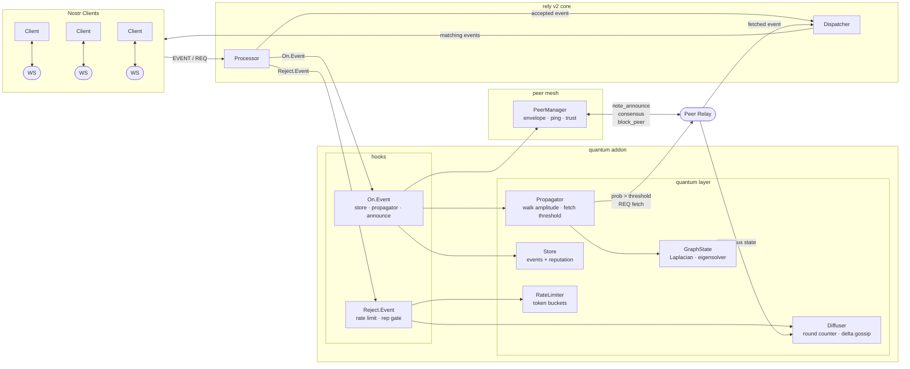

# quantum-relay

A production-ready Nostr relay implementation built on [rely v2](../../README.md) that uses **continuous-time quantum walk propagation** to decide which notes to proactively fetch from peer relays, combined with a **gossip-based reputation and consensus layer** to suppress spam at the network level.

This is the concrete `quantum-relay` application that ships in this repository.

---

## Features

| Feature | Description |
|---|---|
| **Quantum walk propagation** | Propagation probability from relay *s* to relay *i* is computed as \|⟨i\|exp(−iLt)\|s⟩\|², where *L* is the graph Laplacian of the relay mesh |
| **Reputation damping** | Negative-reputation pubkeys have their propagation amplitude damped by `exp(−2γ\|rep\|t)`, making spam harder to propagate network-wide |
| **Diffusive consensus** | Peers converge on a shared round counter and reputation map through neighbour-averaging gossip with clamped `[−1, 1]` scores |
| **Trusted peers** | Operator-configured peer weights influence consensus merges, trusted peer broadcasts, block propagation, and reputation deltas |
| **P2P peer mesh** | Typed WebSocket envelope protocol (`type`/`payload`) with 30-second keepalive pings and buffered per-peer send queues |
| **Token-bucket rate limiting** | Independent per-client and per-peer token buckets; no external dependencies |
| **SQLite persistence** | Events and reputation survive restarts; configurable path, falls back to `:memory:` |
| **Fetch backpressure** | Configurable concurrency cap on outbound fetches prevents goroutine bursts |
| **NIP-42 auth enforcement** | Optional: reject unauthenticated EVENT submissions; sends AUTH challenge on connect |
| **NIP-09 deletion** | Kind-5 events delete referenced notes, enforcing pubkey ownership |
| **YAML configuration** | Zero-dependency config parser; sane defaults if file is missing |
| **NIP-01 / NIP-11 / NIP-42** | Full Nostr protocol support via rely v2 |

---

## How It Works

### 1. Relay graph & Laplacian

At startup, all known relay URLs (local + configured peers) are assembled into a graph. An adjacency list is maintained in `GraphState`. When topology changes, the graph Laplacian is recomputed:

```
L[i][i] = degree(i)
L[i][j] = -1  if connected, else 0
```

For graphs up to 128 nodes, exact eigendecomposition is performed using the built-in **Jacobi algorithm** (no external linear-algebra library required). For larger graphs, propagation falls back to a **truncated Taylor expansion** of exp(−iLt) applied as a sparse matrix-vector product (up to 16 terms, converging to 1×10⁻¹⁰).

### 2. Quantum walk propagation

When a note arrives (from a client event or a peer `note_announce`), it is registered with the `Propagator` along with its source relay and the current consensus round.

On each `quantum_tick`, the propagator calls `Tick(currentRound, γ)` which evaluates every active note:

```
t    = currentRound − bornRound
amp  = ⟨localIndex | exp(−iLt) | sourceIndex⟩
prob = |amp|²  × ReputationFactor(rep, γ, t)
```

If `prob > fetch_threshold`, the note is fetched from its source relay. A small **exploration floor** (`0.02 × (1 − exp(−t/25))`) prevents notes from getting permanently stuck at zero probability in weakly-connected graphs.

The fetch itself is a real websocket round-trip: the relay opens a connection back to the source relay, sends a Nostr `REQ` for the specific note ID, waits for `EVENT`/`EOSE`, and stores the returned note locally. That means the quantum layer reduces actual relay-to-relay traffic, not just internal bookkeeping.

#### Hop count does not predict propagation speed

A counterintuitive but validated property of the walk: **a direct neighbour (1 hop) is not necessarily fetched before a 2-hop relay**. The amplitude `⟨i|exp(−iLt)|s⟩` is a sum of rotating phase components — one per eigenvalue of the Laplacian. At any given time `t`, those components may constructively or destructively interfere depending on the graph structure. A 2-hop path can accumulate constructive interference earlier than a 1-hop path whose phase happens to cancel at the local relay.

Empirically (see `internal/quantum/topology_test.go`):

| Topology | Source | First fetch round | Peak probability |
|---|---|---|---|
| Hierarchical (15 relays) | Sibling leaf (2 hops) | 3 | 0.2281 |
| Hierarchical (15 relays) | Direct hub (1 hop) | 17 | 0.0983 |
| Hierarchical (15 relays) | Far leaf (4 hops) | never | 0.0247 |
| Flat mesh (15 relays, fully connected) | Any source | floor-driven | 0.0178 |

The flat-mesh result is the most important for Nostr deployments: in a fully-connected relay graph, walk probability stays below threshold for all sources and the exploration floor drives all propagation. **The quantum walk adds the most value in non-uniform, hierarchical, or sparse topologies** — exactly the kind of mesh that forms when relays have different specialisations, geographic locations, or trust relationships.

### 3. Reputation damping

```go
func ReputationFactor(rep, gamma, t float64) float64 {
    if rep >= 0 { return 1.0 }
    return math.Exp(-2.0 * gamma * math.Abs(rep) * t)
}
```

Positive reputation has no effect. Negative reputation exponentially suppresses propagation over time; the stronger the negative score and the higher γ, the faster the damping.

### 4. Diffusive consensus

The `Diffuser` runs a background ticker that:
1. Increments the local round counter
2. Broadcasts a `consensus` envelope to all peers containing only the **delta** (changed reputation scores since last broadcast)

On receiving a neighbour's state, round and reputation are merged by neighbour-averaging:

```
round = round(local + neighbour) / 2
rep[k] = clamp((local[k] + neighbour[k]) / 2, -1, 1)
```

This is a standard gossip diffusion protocol — values converge globally over O(diameter) rounds.

### 5. Trusted peers

Trusted peers are configured locally. Each peer URL can be assigned a weight multiplier and an enabled flag in `trust:`. That weight is used for:

- weighted consensus merges
- trusted peer broadcasts
- trusted `block_peer` propagation
- kind-1984 reputation deltas

This keeps trust operator-controlled and local to each relay. There is no global trust registry.

### 6. Spam protection

Two layers:
- **Token-bucket rate limiting** — per client-UID and per peer URL, configured events/sec
- **Reputation gate** — events from pubkeys with reputation < −0.5 are rejected at the rely `Reject.Event` hook before any processing
- **Kind-1984 reports** — trusted spam reports reduce reputation through the same local reputation map, so later ingest decisions see the updated score immediately

---

## Network Benefits

### Note reach beyond the author's relay list

In standard Nostr, a note's reach is bounded by the author's relay list. If an author never published to relay X, their note never reaches relay X regardless of how many of relay X's subscribers would want it.

With quantum propagation, the author publishes to one or a few relays. Those relays announce the note to their peers via `note_announce`. Each peer evaluates walk probability and fetches if the threshold is met, then announces further. The note propagates through relays the author has never configured or interacted with:

```
Author → Relay A → Relay B → Relay C → Relay D
                                          ↑
                              author never knew this existed,
                              but a subscriber is here
```

This solves the relay fragmentation problem at the protocol level rather than pushing it onto clients.

### Reputation travels ahead of content

Reputation converges across the mesh via diffusive consensus — relays share and average reputation scores every consensus tick. A well-regarded pubkey's positive reputation reaches relays before their notes do, meaning those relays are already primed to fetch their content when a `note_announce` arrives.

### Bandwidth reduction

| Layer | Current Nostr | With quantum propagation |
|---|---|---|
| Client upload | Publish to 10–20 relays simultaneously | Publish to 1–3; mesh carries the rest |
| Relay inbound | Receives every client publish blast | Receives targeted fetches only |
| Relay outbound | Re-pushes to all peers | Serves local subscribers only |
| Spam | Hits every relay the client publishes to | Never propagates past originating relay |
| Subscriber delivery | Same event once per connected relay | Once from local relay |

Propagation cost is proportional to demand — notes nobody fetches cost only a single lightweight `note_announce` gossip message. Notes that cross the fetch threshold are fetched once per relay, with in-flight deduplication preventing concurrent duplicate fetches for the same note ID.

### Spam containment

Spam notes from low-reputation pubkeys have their walk probability exponentially damped by `exp(−2γ|rep|t)`. They are never fetched by peer relays, so spam cost is contained to the originating relay and does not consume mesh bandwidth or storage. As reputation diffuses across the mesh, the same pubkey is suppressed network-wide within O(diameter) consensus rounds — without any central blocklist.

---

## Benchmark Results

Run on Intel Core i3-10110U @ 2.10GHz, Go 1.24, linux/amd64:

| Benchmark | Iterations | Time/op | Allocs/op |
|---|---|---|---|
| `PropagatorTick` — 100 notes, 10-relay graph | 817,332 | **3,954 ns** | 2 |
| `PropagatorTick` — 1,000 notes, 10-relay graph | 98,125 | **43,741 ns** | 2 |
| `PropagatorTick` — 5,000 notes, 10-relay graph | 19,513 | **203,242 ns** | 2 |
| `PropagatorTick` — 1,000 notes, 256-relay sparse | 7,472 | **410,229 ns** | 20 |
| `PropagatorTick` — shared source (1,000 notes) | 94,003 | **43,561 ns** | 2 |
| `PropagatorTick` — mixed sources (1,000 notes) | 52,398 | **74,082 ns** | 2 |
| `GraphRecompute` — 16-relay dense | 266,432 | **11,692 ns** | 35 allocs |
| `GraphRecompute` — 64-relay dense | 10,000 | **351,091 ns** | 131 allocs |
| `GraphRecompute` — 256-relay sparse (Taylor) | 100,000,000 | **30 ns** | 0 |
| `ScheduleRecompute` debounce (64-relay) | 48,400,712 | **70 ns** | 0 |
| `QuantumChurn` — topology change + tick (32 relays) | 49,532 | **85,945 ns** | 69 allocs |

Key observations:
- Tick is **allocation-near-free** (2 allocs regardless of note count) thanks to per-tick cache reuse keyed on `(sourceIndex, bornRound)` — notes sharing a source/round share a single amplitude computation.
- Sparse graphs >128 nodes skip eigendecomposition entirely and cost **30 ns/recompute** at zero allocations.
- A 1,000-note tick completes in **~44 µs** — well within a 1-second quantum tick budget.

---

## Configuration

```yaml
relay:
  listen: ":8080"
  public_url: "wss://relay.example.com"
  name: "My Quantum Relay"
  description: "Nostr relay with quantum walk propagation"

peer:
  listen: ":8081"
  public_port: 8443        # optional separate peer websocket port for note_announce

quantum:
  gamma: 0.5                   # reputation damping strength
  fetch_threshold: 0.05        # minimum walk probability to trigger a fetch
  consensus_tick_ms: 500       # how often to gossip consensus state to peers
  quantum_tick_ms: 1000        # how often to evaluate propagation probabilities
  max_concurrent_fetches: 32   # max parallel outbound fetch goroutines

storage:
  path: "events.db"            # SQLite file path; ":memory:" for in-process only

auth:
  required: false              # require NIP-42 auth before accepting EVENT submissions

spam:
  client_events_per_sec: 10    # token-bucket rate per client
  peer_announce_per_sec: 100   # token-bucket rate per peer relay

peers:
  - "ws://relay2.example.com"
  - "ws://relay3.example.com"

trust:
  enabled: false               # enable local trusted-peer behaviour
  weight: 2.0                  # trust multiplier for listed peers
  peers:
    - "ws://relay2.example.com"
```

By default the binary reads `configs/config.yaml` relative to its working directory. Set `RELY_CONFIG=/etc/rely/config.yaml` to point the relay at an external config file, which is what the deployment script and systemd service use. If the file is missing, all defaults above apply.

### Key parameters

| Parameter | Effect |
|---|---|
| `relay.public_url` | External websocket URL advertised to peers in `note_announce` and used as the fetch source. Leave empty to fall back to the local listen address. |
| `gamma` | Higher = faster damping of negative-reputation pubkeys. 0 disables damping. |
| `fetch_threshold` | Lower = fetch more aggressively. 0 fetches everything. |
| `consensus_tick_ms` | Faster = quicker reputation convergence; more network traffic. |
| `quantum_tick_ms` | Faster = notes fetched sooner; higher CPU. |
| `max_concurrent_fetches` | Cap on parallel outbound fetch goroutines. Higher = more responsive under load; lower = less resource use. |
| `storage.path` | Path to SQLite database file. Use `":memory:"` for ephemeral in-process storage. |
| `auth.required` | When true, clients must complete NIP-42 auth before events are accepted. |
| `trust.enabled` | Enables trusted-peer weighting and trusted block propagation. |
| `trust.weight` | Multiplier applied to listed trusted peers. |
| `trust.peers` | List of peer URLs that should receive the trust weight. |

---

## Running `quantum-relay`

```bash
go build ./cmd/quantum-relay
./quantum-relay
```

Or with a config file:

```bash
RELY_CONFIG=/etc/rely/config.yaml ./quantum-relay
```

For a guided install/update flow on Linux hosts, see `scripts/deploy.sh`.

---

## Architecture



### File tree

```
cmd/quantum-relay/
  main.go          — wiring: relay hooks, peer message dispatch, tick loops
  config.go        — YAML config loader (no external deps)

internal/
  quantum/
    graph.go       — GraphState: Laplacian, Jacobi eigensolver, sparse Taylor fallback
    walk.go        — Propagator: per-note amplitude evaluation, fetch triggering, eviction
    damping.go     — ReputationFactor: exp damping for negative-rep pubkeys
  consensus/
    diffuser.go    — Diffuser: round counter, delta-gossip, neighbour-averaging merge
  p2p/
    peer.go        — PeerManager: WebSocket dial, typed Envelope, buffered send/ping
  spam/
    detector.go    — RateLimiter: per-ID token buckets (no stdlib rate pkg needed)
  storage/
    store.go           — Store: in-memory events + per-pubkey reputation
    sqlite_store.go    — SQLiteStore: persistent events + reputation via modernc.org/sqlite
    store_interface.go — EventStore interface (Save/Get/Delete/Query/reputation methods)
```

---

## Package Boundaries

Each internal package has one responsibility and no inward dependencies on other internal packages. `main.go` owns all the wiring between them, keeping the packages independently testable.

---

## Tests

```bash
# Unit + integration
go test ./...

# Benchmarks
go test ./internal/quantum/ -bench=. -benchmem

# Swarm integration test (spins up multiple in-process relays)
go test ./tests/ -v -run TestQuantumSwarm

# Spam stress test
go test ./tests/ -v -run TestSpamStress

# Trusted-peer integration tests
go test ./cmd/quantum-relay/ -v -run TestTrustedMesh
go test ./cmd/quantum-relay/ -v -run TestFetchEventFromRelay

# Live source propagation smoke test against a real relay
RELAY_LIVE_SOURCE=quantum-relay.3nostr.com go test ./cmd/quantum-relay/ -v -run TestQuantumRelayLiveSourcePropagation
```
